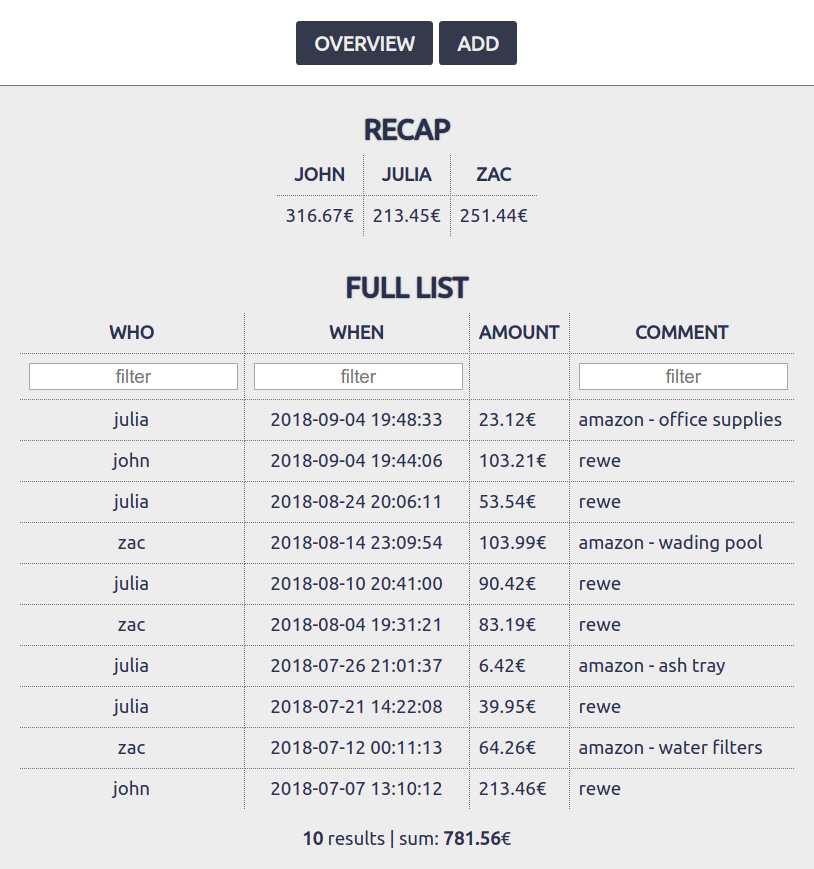
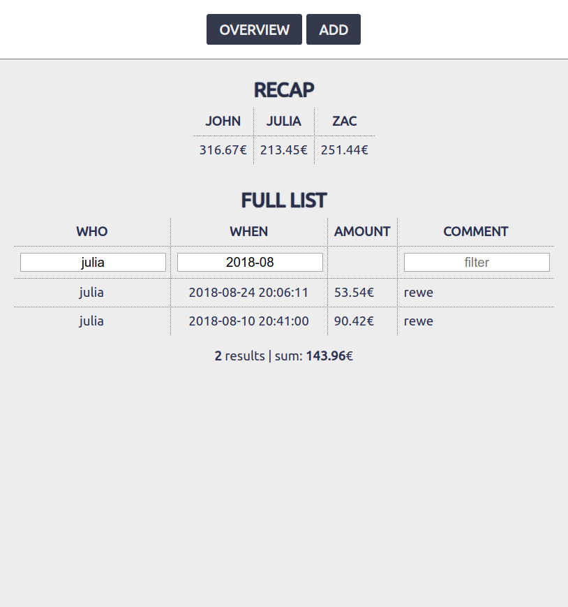
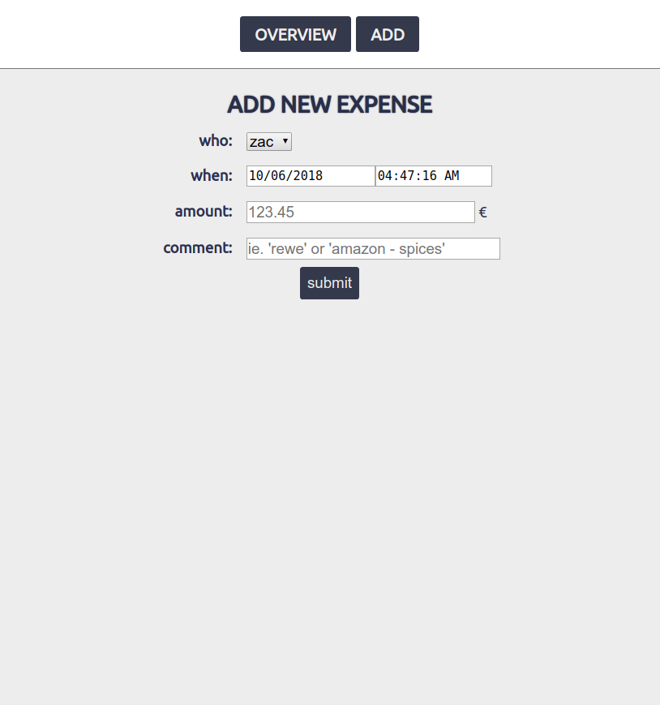

# budget calc

**[budget calc](https://github.com/davidwinterstein/budget-calc)** is a simple little tool to help you keep track of the expenses of all the members in your household.  Ideally, you set this up on your public webserver (and add a `.htaccess` password protection), so you can add expenses directly from your phone just after paying.

---

There are two simple main pages.  
On the "overview" page you see a quick recap about the expenses per person and then a full, filterable list of all expenses:  

The results and sum below the list update in real time when filters are set:

On the "add" page you can add new entries:  

---

How to use:
1. Create a database on your database server.
1. Download the repository contents to your web server.
1. Provide database access parameters in [`config.php`](config.php).
1. Edit [`db.sql`](db.sql) to fit your needs (you'll just want to change `john`, `julia` and `zac` to the names you need) and import it into the database.
1. Recommended: Setup a `.htaccess` password protection. The HTTP basic auth **user name is preselected on the add page** if it exists in the database.
